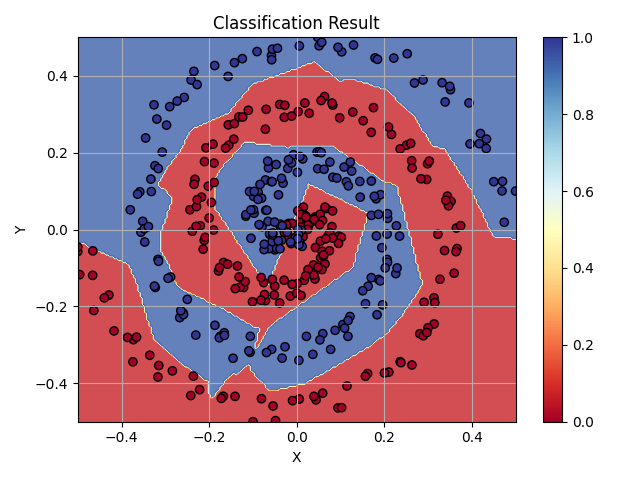
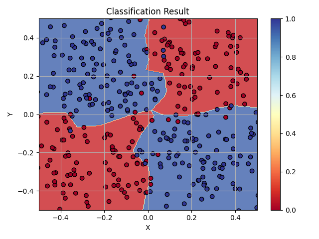
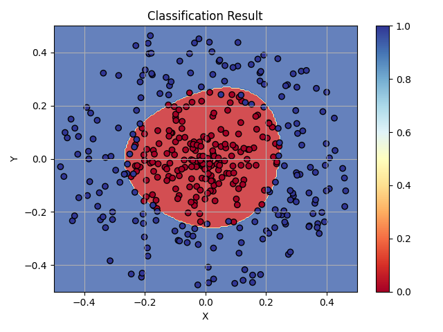
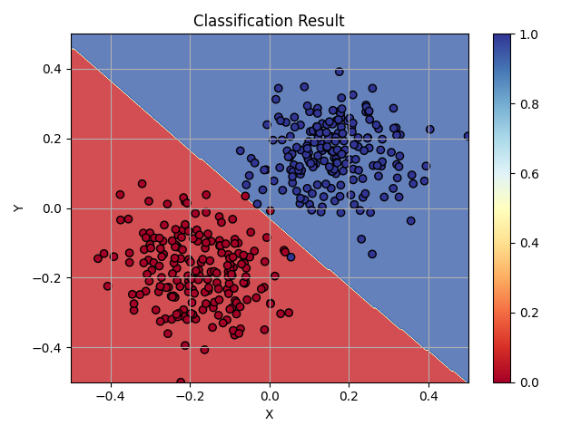

**Для SPIRAL:**
- Скрытые слои: [10, 10, 10, 10, 10]
- Скорость обучения: 0.001
- Количество эпох: 500
- Тип выборки: spiral
- Функция активации: ReLU
- Время обучения: ~12.27 секунд
- Точность на тестовом наборе данных: 91.00%
- Средняя точность на кросс-валидации: 93.00%

**Для XOR:**
- Размер входа: 2
- Размер выхода: 2
- Скрытые слои: [5]
- Скорость обучения: 0.01
- Количество эпох: 100
- Тип выборки: XOR
- Функция активации: tanh
- Количество образцов: 400
- Допустимая ошибка: 0.1
- Время обучения: ~0.91 секунд
- Точность на тестовом наборе данных: 95.25%
- Средняя точность на кросс-валидации: 83.25%

**Для CIRCLE:**
- Размер входа: 2
- Размер выхода: 2
- Скрытые слои: [6]
- Скорость обучения: 0.01
- Количество эпох: 100
- Тип выборки: circle
- Функция активации: tanh
- Количество образцов: 400
- Допустимая ошибка: 0.1
- Точность на тестовом наборе данных: 94.75%
- Средняя точность на кросс-валидации: 90.50%

**Для GAUSSIAN:**
- Размер входа: 2
- Размер выхода: 2
- Скрытые слои: [3]
- Скорость обучения: 0.01
- Количество эпох: 100
- Тип выборки: gaussian
- Функция активации: ReLU
- Количество образцов: 400
- Допустимая ошибка: 0.1
- Время обучения: ~0.91 секунд
- Точность на тестовом наборе данных: 99.25%
- Средняя точность на кросс-валидации: 99.00%

